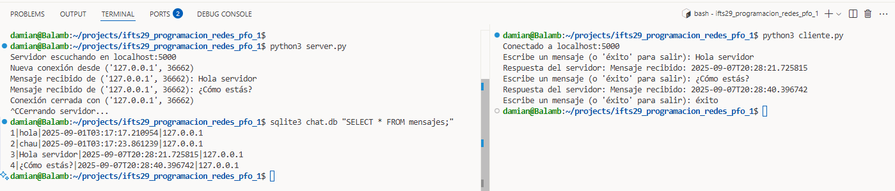

# IFTS 29 - Tecnicatura en Desarrollo de Software
## Programación sobre redes - 3° D

### Práctica Formativa Obligatoria 1
**Alumno:** Damián Andrés Clausi  
**Profesor:** Germán Ríos

# Chat Básico Cliente-Servidor con Sockets y Base de Datos

## Descripción
Este proyecto implementa un sistema de chat básico en Python utilizando sockets TCP/IP y una base de datos SQLite. Permite que múltiples clientes se conecten a un servidor, envíen mensajes y que estos mensajes se almacenen en una base de datos junto con la fecha y la IP del cliente.

## Estructura del Proyecto
- `server.py`: Código del servidor. Escucha conexiones, recibe mensajes y los guarda en la base de datos.
- `cliente.py`: Código del cliente. Permite enviar mensajes al servidor y muestra la respuesta.
- `chat.db`: Base de datos SQLite donde se almacenan los mensajes.

## Requisitos
- Python 3.x
- Módulo estándar `sqlite3` (incluido en Python)

## Ejecución y Ejemplo de Uso

### 1. Iniciar el servidor
En una terminal, ejecuta:
```bash
python3 server.py
```
Salida esperada:
```
Servidor escuchando en localhost:5000
```

### 2. Ejecutar el cliente
En otra terminal, ejecuta:
```bash
python3 cliente.py
```
Ejemplo de interacción:
```
Conectado a localhost:5000
Escribe un mensaje (o 'éxito' para salir): Hola servidor
Respuesta del servidor: Mensaje recibido: 2025-09-07T20:28:21.725815
Escribe un mensaje (o 'éxito' para salir): ¿Cómo estás?
Respuesta del servidor: Mensaje recibido: 2025-09-07T20:28:40.396742
Escribe un mensaje (o 'éxito' para salir): éxito
```

### 3. Salida esperada en el servidor
```
Servidor escuchando en localhost:5000
Nueva conexión desde ('127.0.0.1', 36662)
Mensaje recibido de ('127.0.0.1', 36662): Hola servidor
Mensaje recibido de ('127.0.0.1', 36662): ¿Cómo estás?
Conexión cerrada con ('127.0.0.1', 36662)
```

### 4. Consultar los mensajes guardados en la base de datos
Ejecuta:
```bash
sqlite3 chat.db "SELECT * FROM mensajes;"
```
Ejemplo de salida:
```
1|hola|2025-09-01T03:17:17.210954|127.0.0.1
2|chau|2025-09-01T03:17:23.861239|127.0.0.1
3|Hola servidor|2025-09-07T20:28:21.725815|127.0.0.1
4|¿Cómo estás?|2025-09-07T20:28:40.396742|127.0.0.1
```

## Screenshot Terminal




## Notas
- El servidor maneja múltiples clientes usando hilos.
- Cada mensaje se almacena con su contenido, fecha de envío e IP del cliente.
- El código está modularizado y documentado para facilitar su comprensión.

> **Nota sobre los puertos:**
> El servidor siempre escucha en el puerto fijo 5000. El número que aparece junto a la IP del cliente (por ejemplo, 36662) es un puerto de origen asignado dinámicamente por el sistema operativo al cliente cada vez que se conecta. Esto es normal y puede variar en cada ejecución.
